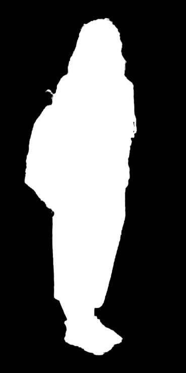

# Human Segmenter

## 📌 Description
This repository provides a simple human segmentation tool based on a pre-trained TensorFlow frozen graph (`.pb` model).  
It generates binary masks for human regions in images, which can be used for background removal, matting, or preprocessing pipelines.

---

## ⚙️ Installation
Clone the repo and install dependencies:

```bash
git clone https://github.com/Rainiver/human-segmenter.git
cd human-segmenter
pip install -r requirements.txt
```

> Note: The script uses `tensorflow.compat.v1` and disables v2 behavior. If you have TF v2 installed, the compatibility wrapper is used in the code.

---

## 📦 Model Download  

Download the pre-trained model file `matting_human.pb` from Google Drive:

[Download matting_human.pb](https://drive.google.com/file/d/1deOGzwQ_yLIgJfncsya4wBVR3A2HKpWE/view?usp=drive_link)

Place the downloaded file in the `model/` folder of the repository:  

```text
human-segmenter/
├── segmenter.py
├── model/
│   └── matting_human.pb
└── ...
```

## 🚀 Usage

### 1. Prepare files
- Place the pre-trained model file `matting_human.pb` (or your `.pb` model) in the project root.
- Put input images into the `./data/` folder (create it if missing).
- Ensure there is an (empty) `./mask/` folder, or the script will create output files in `./mask/` automatically.

### 2. Run segmentation
```bash
python segmenter.py
```

---

## 🖼️ Example

<div style="display: flex; align-items: flex-start;">
<table>
  <tr>
    <td align="center">
      <b>Input</b><br>
      
    </td>
    <td align="center">
      <b>Output</b><br>
      
    </td>
  </tr>
</table>
